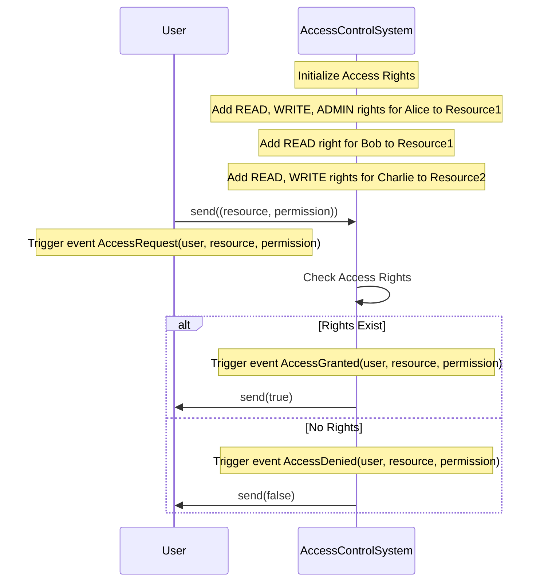

```mermaid
sequenceDiagram
    participant User
    participant AccessControlSystem

    Note over AccessControlSystem: Initialize Access Rights
    Note over AccessControlSystem: Add READ, WRITE, ADMIN rights for Alice to Resource1
    Note over AccessControlSystem: Add READ right for Bob to Resource1
    Note over AccessControlSystem: Add READ, WRITE rights for Charlie to Resource2

    User->>AccessControlSystem: send((resource, permission))
    Note over User: Trigger event AccessRequest(user, resource, permission)

    AccessControlSystem->>AccessControlSystem: Check Access Rights
    alt Rights Exist
        Note over AccessControlSystem: Trigger event AccessGranted(user, resource, permission)
        AccessControlSystem->>User: send(true)
    else No Rights
        Note over AccessControlSystem: Trigger event AccessDenied(user, resource, permission)
        AccessControlSystem->>User: send(false)
    end

```
