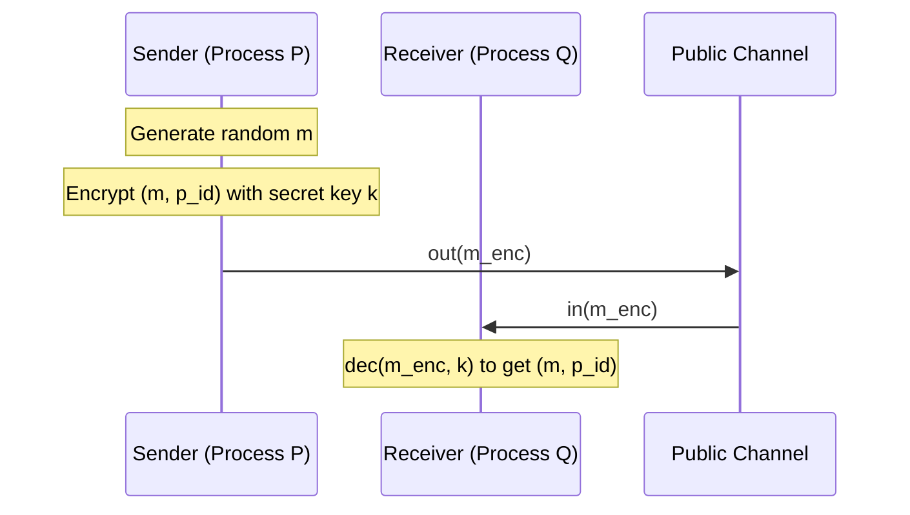

```mermaid
sequenceDiagram
    participant P as Sender (Process P)
    participant Q as Receiver (Process Q)
    participant c as Public Channel

    Note over P: Generate random m
    Note over P: Encrypt (m, p_id) with secret key k
    P->>c: out(m_enc)
    c->>Q: in(m_enc)
    Note over Q: dec(m_enc, k) to get (m, p_id)

```
