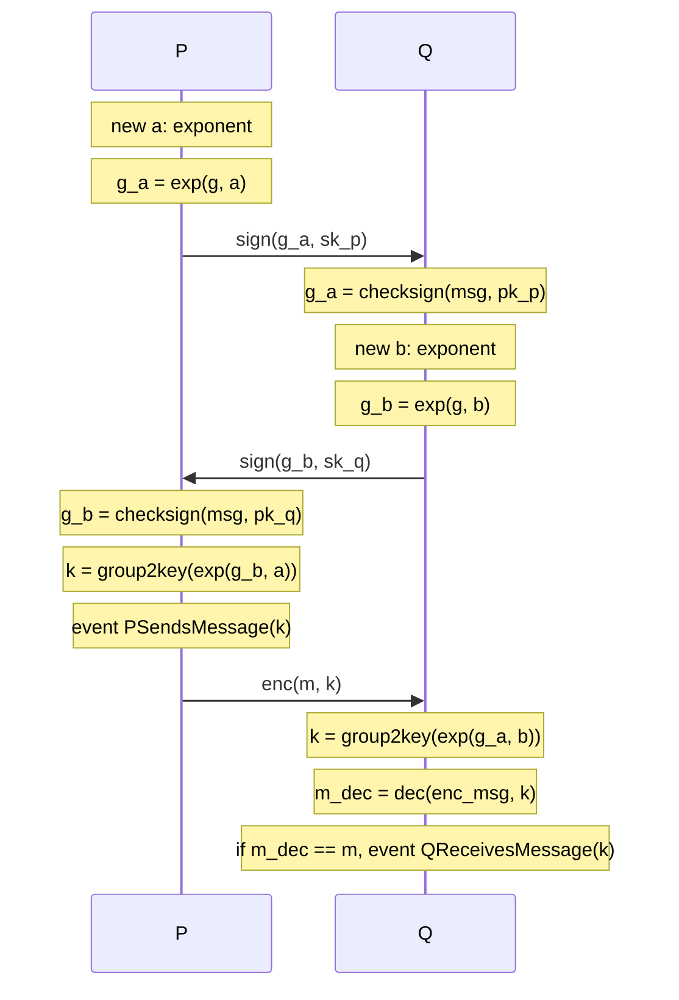

```mermaid
sequenceDiagram
    participant P
    participant Q

    Note over P: new a: exponent
    Note over P: g_a = exp(g, a)
    P->>Q: sign(g_a, sk_p)

    Note over Q: g_a = checksign(msg, pk_p)
    Note over Q: new b: exponent
    Note over Q: g_b = exp(g, b)
    Q->>P: sign(g_b, sk_q)

    Note over P: g_b = checksign(msg, pk_q)
    Note over P: k = group2key(exp(g_b, a))
    Note over P: event PSendsMessage(k)
    P->>Q: enc(m, k)

    Note over Q: k = group2key(exp(g_a, b))
    Note over Q: m_dec = dec(enc_msg, k)
    Note over Q: if m_dec == m, event QReceivesMessage(k)
```
