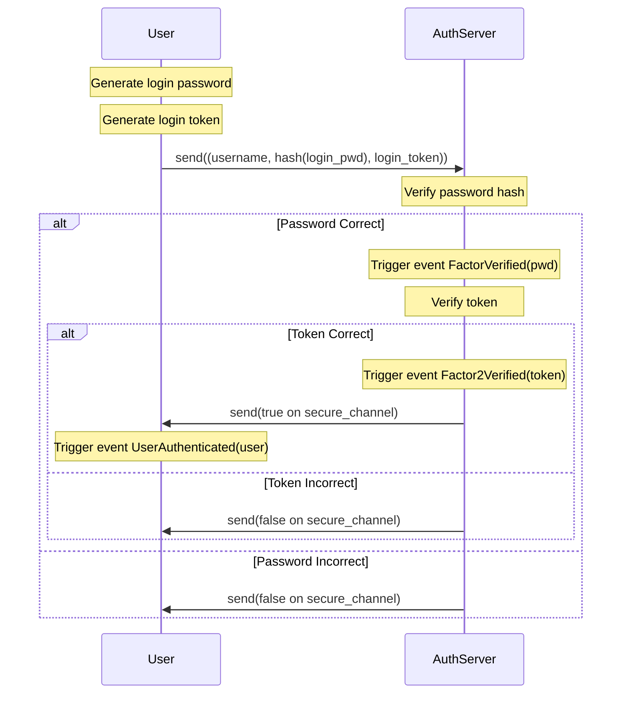

```mermaid
sequenceDiagram
    participant User
    participant AuthServer

    Note over User: Generate login password
    Note over User: Generate login token
    User->>AuthServer: send((username, hash(login_pwd), login_token))

    Note over AuthServer: Verify password hash
    alt Password Correct
        Note over AuthServer: Trigger event FactorVerified(pwd)
        Note over AuthServer: Verify token
        alt Token Correct
            Note over AuthServer: Trigger event Factor2Verified(token)
            AuthServer->>User: send(true on secure_channel)
            Note over User: Trigger event UserAuthenticated(user)
        else Token Incorrect
            AuthServer->>User: send(false on secure_channel)
        end
    else Password Incorrect
        AuthServer->>User: send(false on secure_channel)
    end
```
