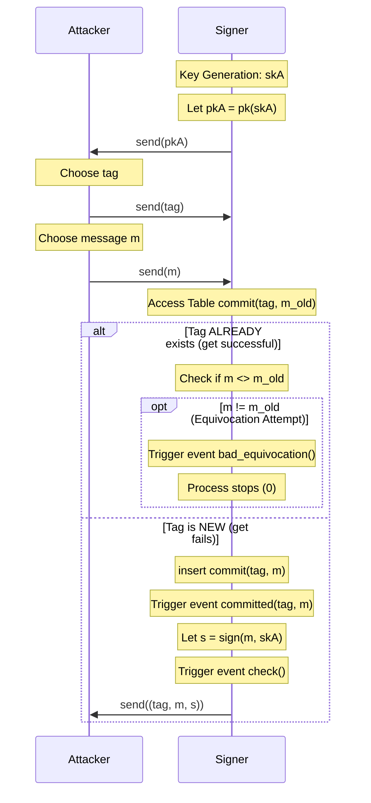

```mermaid
sequenceDiagram
    participant Attacker
    participant Signer

    Note over Signer: Key Generation: skA
    Note over Signer: Let pkA = pk(skA)
    Signer->>Attacker: send(pkA)

    Note over Attacker: Choose tag
    Attacker->>Signer: send(tag)

    Note over Attacker: Choose message m
    Attacker->>Signer: send(m)

    Note over Signer: Access Table commit(tag, m_old)

    alt Tag ALREADY exists (get successful)
        Note over Signer: Check if m <> m_old
        opt m != m_old (Equivocation Attempt)
            Note over Signer: Trigger event bad_equivocation()
            Note over Signer: Process stops (0)
        end
    else Tag is NEW (get fails)
        Note over Signer: insert commit(tag, m)
        Note over Signer: Trigger event committed(tag, m)
        Note over Signer: Let s = sign(m, skA)
        Note over Signer: Trigger event check()
        Signer->>Attacker: send((tag, m, s))
    end
```
