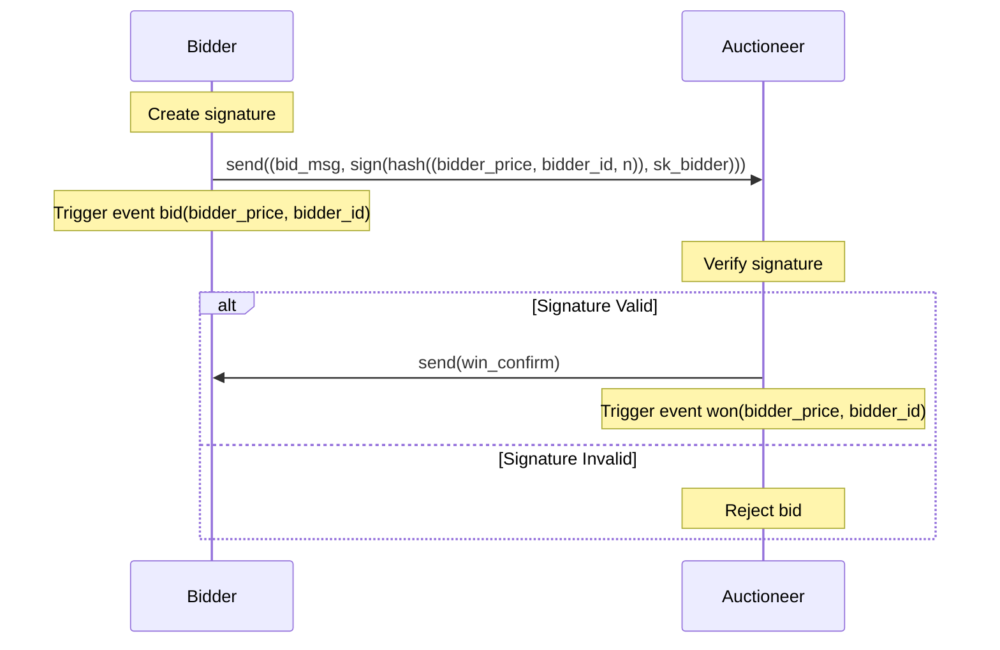

```mermaid
sequenceDiagram
    participant Bidder
    participant Auctioneer

    Note over Bidder: Create signature
    Bidder->>Auctioneer: send((bid_msg, sign(hash((bidder_price, bidder_id, n)), sk_bidder)))
    Note over Bidder: Trigger event bid(bidder_price, bidder_id)

    Note over Auctioneer: Verify signature
    alt Signature Valid
        Auctioneer->>Bidder: send(win_confirm)
        Note over Auctioneer: Trigger event won(bidder_price, bidder_id)
    else Signature Invalid
        Note over Auctioneer: Reject bid
    end
```
