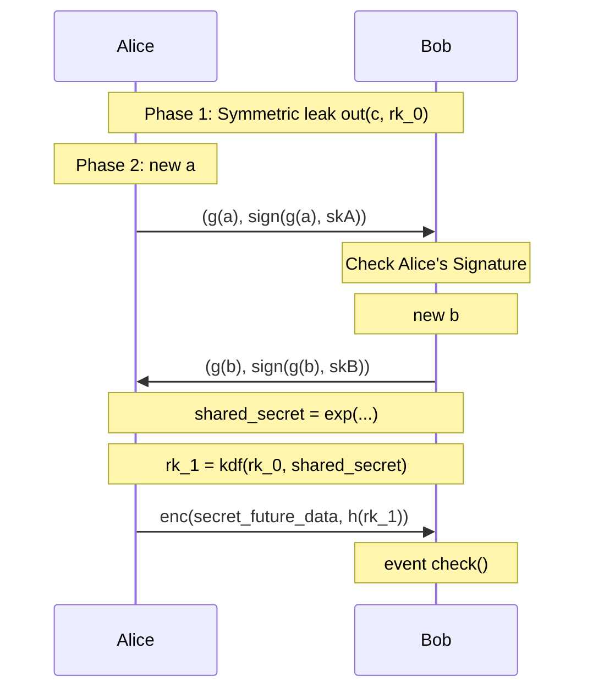

```mermaid
sequenceDiagram
    participant A as Alice
    participant B as Bob

    Note over A, B: Phase 1: Symmetric leak out(c, rk_0)

    Note over A: Phase 2: new a
    A->>B: (g(a), sign(g(a), skA))

    Note over B: Check Alice's Signature
    Note over B: new b
    B->>A: (g(b), sign(g(b), skB))

    Note over A, B: shared_secret = exp(...)
    Note over A, B: rk_1 = kdf(rk_0, shared_secret)

    A->>B: enc(secret_future_data, h(rk_1))
    Note over B: event check()
```
