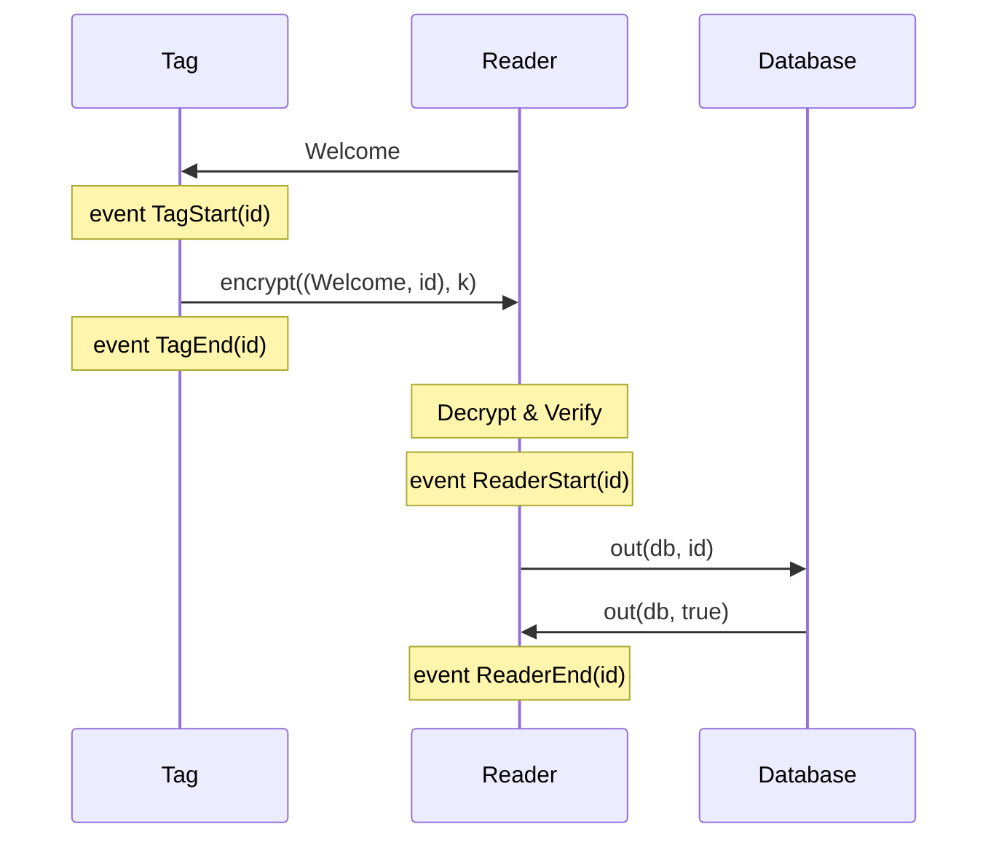

```mermaid
sequenceDiagram
    participant T as Tag
    participant R as Reader
    participant D as Database

    R->>T: Welcome
    Note over T: event TagStart(id)
    T->>R: encrypt((Welcome, id), k)
    Note over T: event TagEnd(id)

    Note over R: Decrypt & Verify
    Note over R: event ReaderStart(id)
    R->>D: out(db, id)
    D->>R: out(db, true)
    Note over R: event ReaderEnd(id)
```
