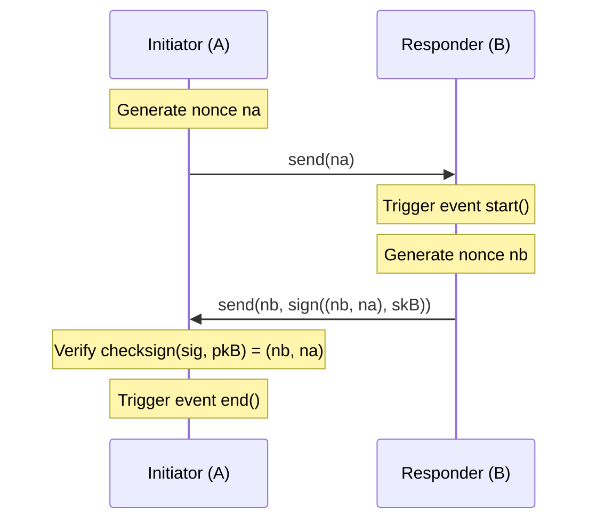

```mermaid
sequenceDiagram
    participant A as Initiator (A)
    participant B as Responder (B)

    Note over A: Generate nonce na
    A->>B: send(na)

    Note over B: Trigger event start()
    Note over B: Generate nonce nb
    B->>A: send(nb, sign((nb, na), skB))

    Note over A: Verify checksign(sig, pkB) = (nb, na)
    Note over A: Trigger event end()
```
