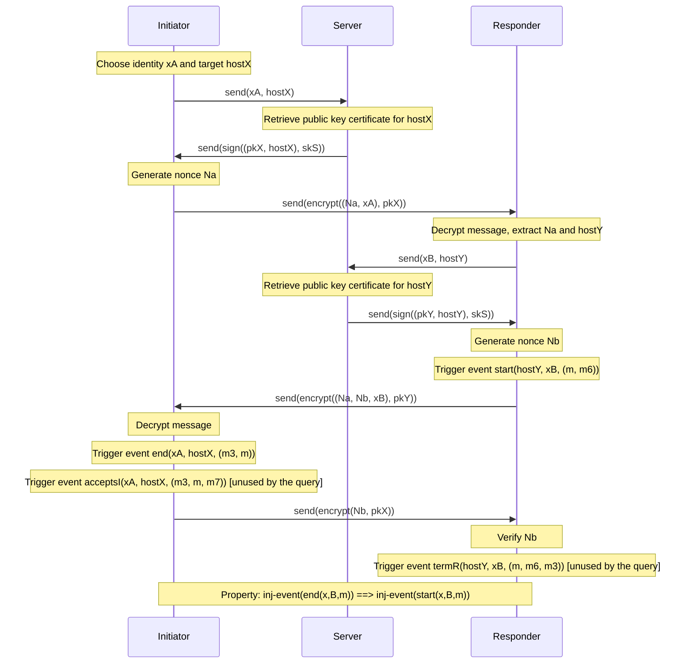

```mermaid
sequenceDiagram
    participant Initiator
    participant Server
    participant Responder

    Note over Initiator: Choose identity xA and target hostX
    Initiator->>Server: send(xA, hostX)

    Note over Server: Retrieve public key certificate for hostX
    Server->>Initiator: send(sign((pkX, hostX), skS))

    Note over Initiator: Generate nonce Na
    Initiator->>Responder: send(encrypt((Na, xA), pkX))

    Note over Responder: Decrypt message, extract Na and hostY
    Responder->>Server: send(xB, hostY)

    Note over Server: Retrieve public key certificate for hostY
    Server->>Responder: send(sign((pkY, hostY), skS))

    Note over Responder: Generate nonce Nb
    Note over Responder: Trigger event start(hostY, xB, (m, m6))
    Responder->>Initiator: send(encrypt((Na, Nb, xB), pkY))

    Note over Initiator: Decrypt message
    Note over Initiator: Trigger event end(xA, hostX, (m3, m))
    Note over Initiator: Trigger event acceptsI(xA, hostX, (m3, m, m7)) [unused by the query]
    Initiator->>Responder: send(encrypt(Nb, pkX))

    Note over Responder: Verify Nb
    Note over Responder: Trigger event termR(hostY, xB, (m, m6, m3)) [unused by the query]

    Note over Initiator, Responder: Property: inj-event(end(x,B,m)) ==> inj-event(start(x,B,m))
```
