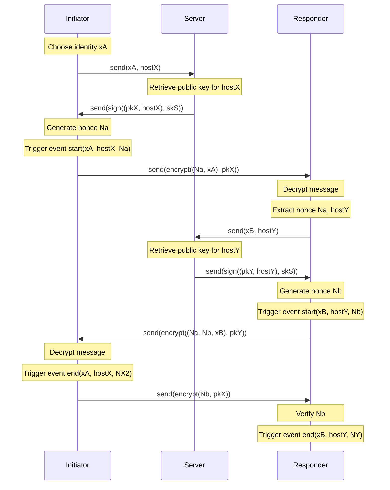

```mermaid
sequenceDiagram
    participant Initiator
    participant Server
    participant Responder

    Note over Initiator: Choose identity xA
    Initiator->>Server: send(xA, hostX)

    Note over Server: Retrieve public key for hostX
    Server->>Initiator: send(sign((pkX, hostX), skS))

    Note over Initiator: Generate nonce Na
    Note over Initiator: Trigger event start(xA, hostX, Na)
    Initiator->>Responder: send(encrypt((Na, xA), pkX))

    Note over Responder: Decrypt message
    Note over Responder: Extract nonce Na, hostY
    Responder->>Server: send(xB, hostY)

    Note over Server: Retrieve public key for hostY
    Server->>Responder: send(sign((pkY, hostY), skS))

    Note over Responder: Generate nonce Nb
    Note over Responder: Trigger event start(xB, hostY, Nb)
    Responder->>Initiator: send(encrypt((Na, Nb, xB), pkY))

    Note over Initiator: Decrypt message
    Note over Initiator: Trigger event end(xA, hostX, NX2)
    Initiator->>Responder: send(encrypt(Nb, pkX))

    Note over Responder: Verify Nb
    Note over Responder: Trigger event end(xB, hostY, NY)
```
