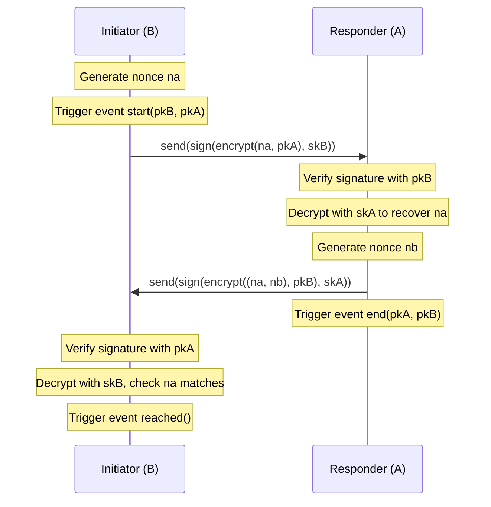

```mermaid
sequenceDiagram
    participant B as Initiator (B)
    participant A as Responder (A)

    Note over B: Generate nonce na
    Note over B: Trigger event start(pkB, pkA)
    B->>A: send(sign(encrypt(na, pkA), skB))

    Note over A: Verify signature with pkB
    Note over A: Decrypt with skA to recover na
    Note over A: Generate nonce nb
    A->>B: send(sign(encrypt((na, nb), pkB), skA))
    Note over A: Trigger event end(pkA, pkB)

    Note over B: Verify signature with pkA
    Note over B: Decrypt with skB, check na matches
    Note over B: Trigger event reached()
```
