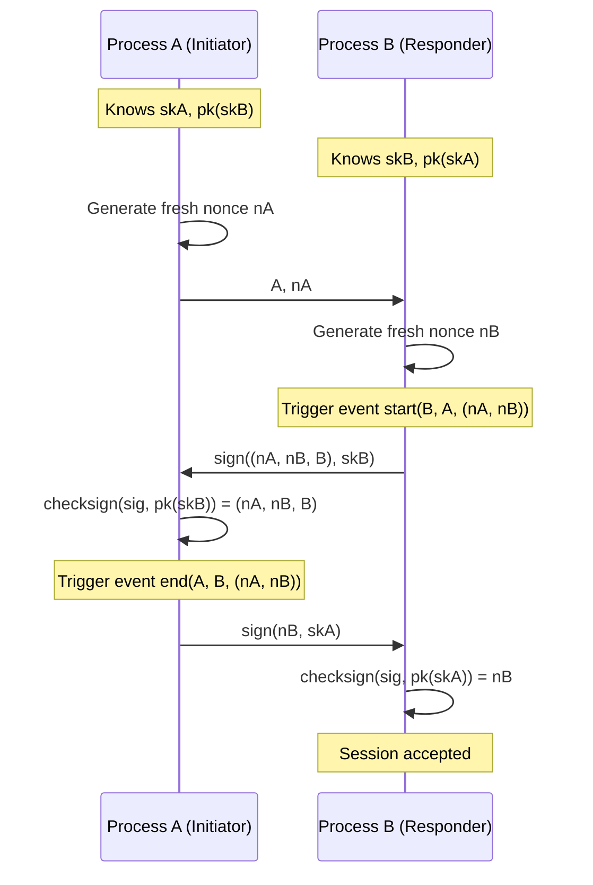

```mermaid
sequenceDiagram
    participant A as Process A (Initiator)
    participant B as Process B (Responder)

    Note over A: Knows skA, pk(skB)
    Note over B: Knows skB, pk(skA)

    A->>A: Generate fresh nonce nA
    A->>B: A, nA

    B->>B: Generate fresh nonce nB
    Note over B: Trigger event start(B, A, (nA, nB))
    B->>A: sign((nA, nB, B), skB)

    A->>A: checksign(sig, pk(skB)) = (nA, nB, B)
    Note over A: Trigger event end(A, B, (nA, nB))
    A->>B: sign(nB, skA)

    B->>B: checksign(sig, pk(skA)) = nB
    Note over B: Session accepted
```
