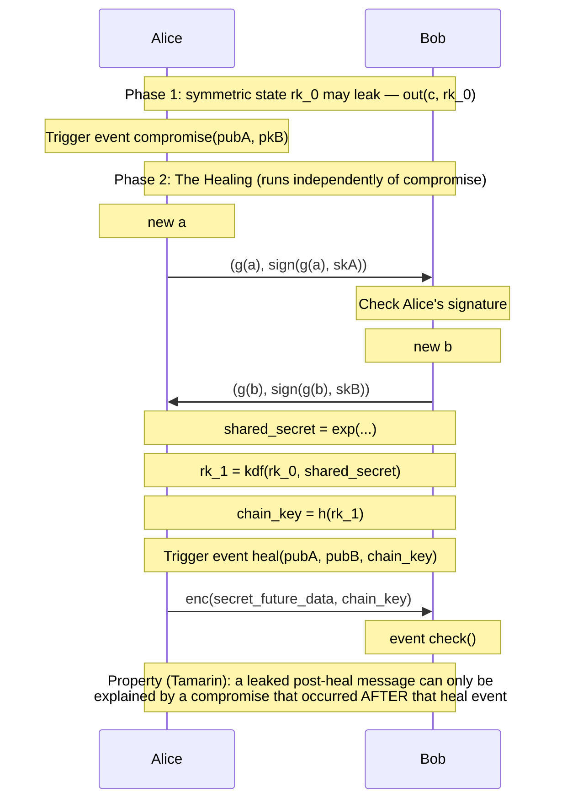

```mermaid
sequenceDiagram
    participant A as Alice
    participant B as Bob

    Note over A, B: Phase 1: symmetric state rk_0 may leak — out(c, rk_0)
    Note over A: Trigger event compromise(pubA, pkB)

    Note over A, B: Phase 2: The Healing (runs independently of compromise)
    Note over A: new a
    A->>B: (g(a), sign(g(a), skA))

    Note over B: Check Alice's signature
    Note over B: new b
    B->>A: (g(b), sign(g(b), skB))

    Note over A, B: shared_secret = exp(...)
    Note over A, B: rk_1 = kdf(rk_0, shared_secret)
    Note over A, B: chain_key = h(rk_1)
    Note over A, B: Trigger event heal(pubA, pubB, chain_key)

    A->>B: enc(secret_future_data, chain_key)
    Note over B: event check()

    Note over A, B: Property (Tamarin): a leaked post-heal message can only be<br/>explained by a compromise that occurred AFTER that heal event
```
