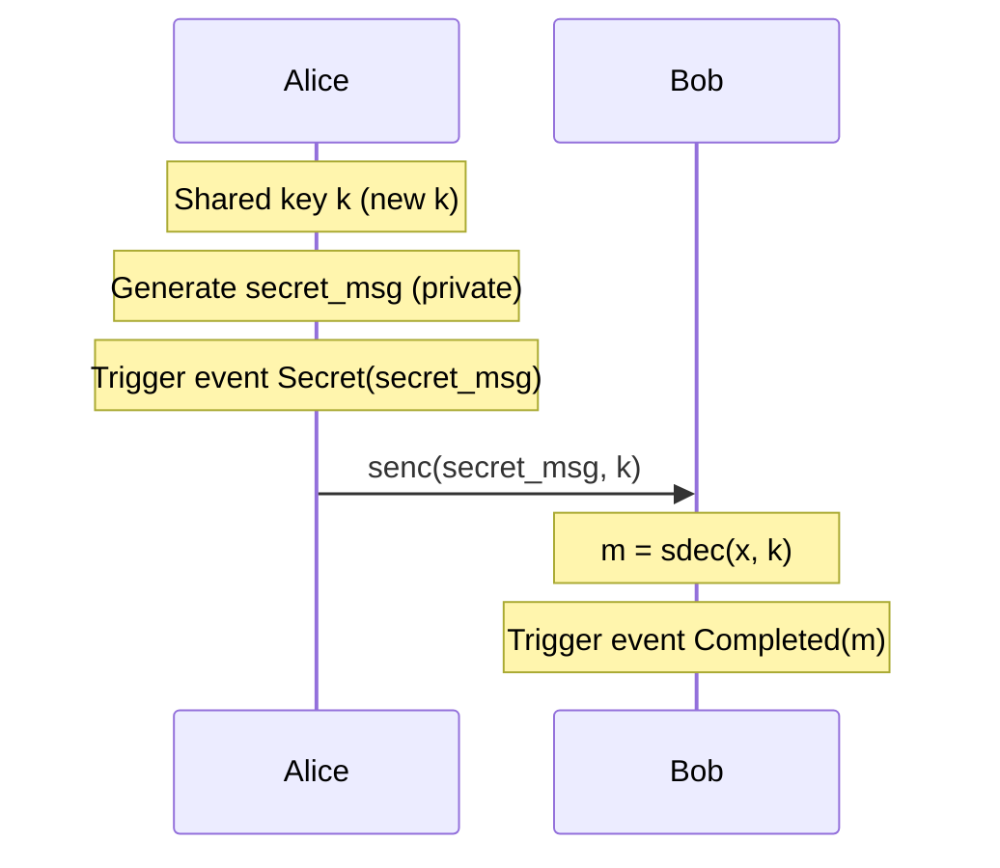

```mermaid
sequenceDiagram
    participant A as Alice
    participant B as Bob

    Note over A: Shared key k (new k)
    Note over A: Generate secret_msg (private)
    Note over A: Trigger event Secret(secret_msg)
    A->>B: senc(secret_msg, k)

    Note over B: m = sdec(x, k)
    Note over B: Trigger event Completed(m)
```
