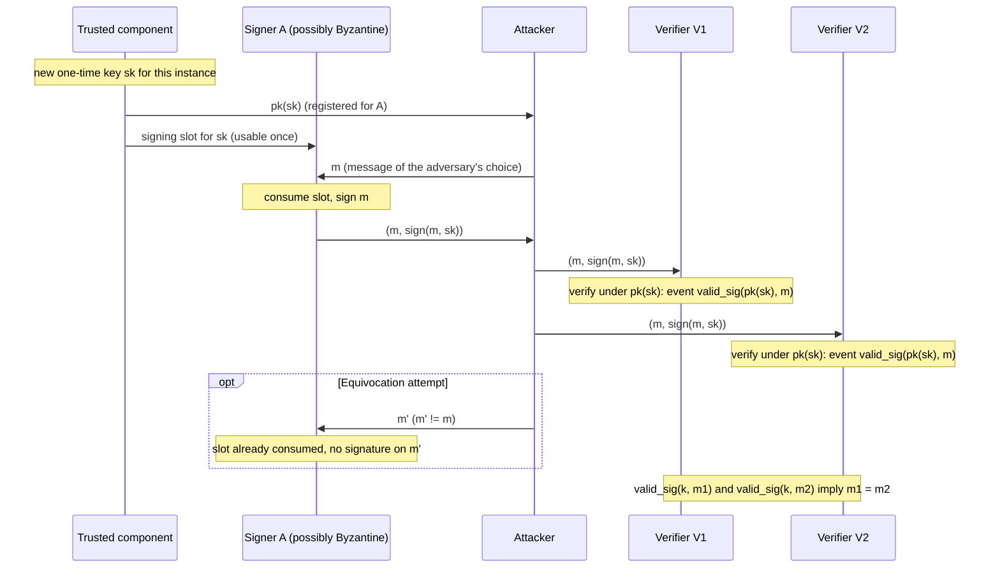

# Non-equivocation — signer-side

```mermaid
sequenceDiagram
    participant TC as Trusted component
    participant Signer as Signer A (possibly Byzantine)
    participant Attacker
    participant V1 as Verifier V1
    participant V2 as Verifier V2

    Note over TC: new one-time key sk for this instance
    TC->>Attacker: pk(sk) (registered for A)
    TC->>Signer: signing slot for sk (usable once)

    Attacker->>Signer: m (message of the adversary's choice)
    Note over Signer: consume slot, sign m
    Signer->>Attacker: (m, sign(m, sk))

    Attacker->>V1: (m, sign(m, sk))
    Note over V1: verify under pk(sk): event valid_sig(pk(sk), m)
    Attacker->>V2: (m, sign(m, sk))
    Note over V2: verify under pk(sk): event valid_sig(pk(sk), m)

    opt Equivocation attempt
        Attacker->>Signer: m' (m' != m)
        Note over Signer: slot already consumed, no signature on m'
    end

    Note over V1, V2: valid_sig(k, m1) and valid_sig(k, m2) imply m1 = m2
```
