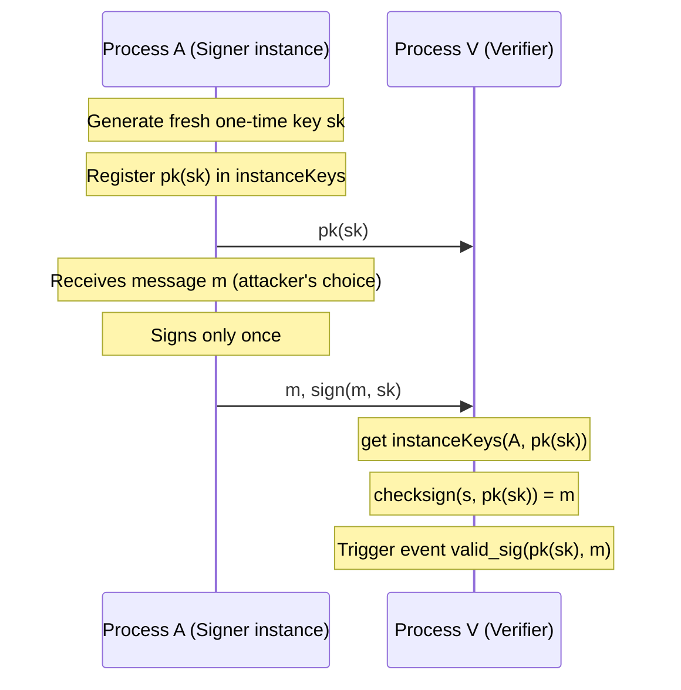

# Non-equivocation — signer-side

```mermaid
sequenceDiagram
    participant A as Process A (Signer instance)
    participant V as Process V (Verifier)

    Note over A: Generate fresh one-time key sk
    Note over A: Register pk(sk) in instanceKeys
    A->>V: pk(sk)

    Note over A: Receives message m (attacker's choice)
    Note over A: Signs only once
    A->>V: m, sign(m, sk)

    Note over V: get instanceKeys(A, pk(sk))
    Note over V: checksign(s, pk(sk)) = m
    Note over V: Trigger event valid_sig(pk(sk), m)
```
