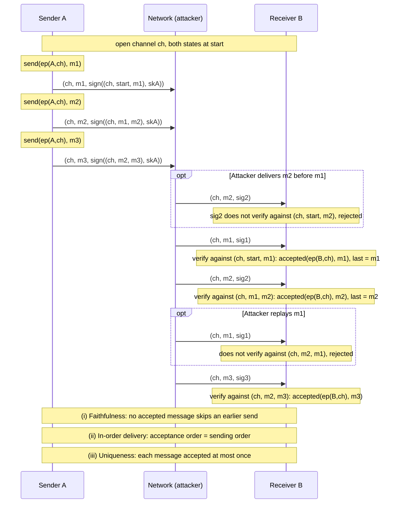

# Non-equivocation — channel-side

```mermaid
sequenceDiagram
    participant A as Sender A
    participant Net as Network (attacker)
    participant B as Receiver B

    Note over A, B: open channel ch, both states at start

    Note over A: send(ep(A,ch), m1)
    A->>Net: (ch, m1, sign((ch, start, m1), skA))
    Note over A: send(ep(A,ch), m2)
    A->>Net: (ch, m2, sign((ch, m1, m2), skA))
    Note over A: send(ep(A,ch), m3)
    A->>Net: (ch, m3, sign((ch, m2, m3), skA))

    opt Attacker delivers m2 before m1
        Net->>B: (ch, m2, sig2)
        Note over B: sig2 does not verify against (ch, start, m2), rejected
    end

    Net->>B: (ch, m1, sig1)
    Note over B: verify against (ch, start, m1): accepted(ep(B,ch), m1), last = m1
    Net->>B: (ch, m2, sig2)
    Note over B: verify against (ch, m1, m2): accepted(ep(B,ch), m2), last = m2

    opt Attacker replays m1
        Net->>B: (ch, m1, sig1)
        Note over B: does not verify against (ch, m2, m1), rejected
    end

    Net->>B: (ch, m3, sig3)
    Note over B: verify against (ch, m2, m3): accepted(ep(B,ch), m3)

    Note over A, B: (i) Faithfulness: no accepted message skips an earlier send
    Note over A, B: (ii) In-order delivery: acceptance order = sending order
    Note over A, B: (iii) Uniqueness: each message accepted at most once
```
