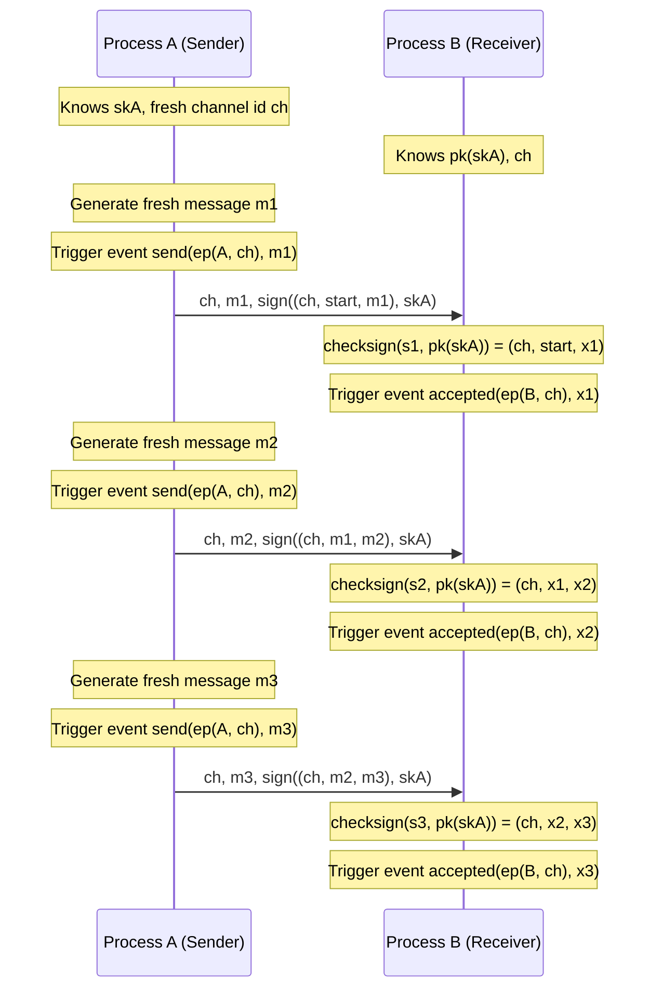

# Non-equivocation — channel-side

```mermaid
sequenceDiagram
    participant A as Process A (Sender)
    participant B as Process B (Receiver)

    Note over A: Knows skA, fresh channel id ch
    Note over B: Knows pk(skA), ch

    Note over A: Generate fresh message m1
    Note over A: Trigger event send(ep(A, ch), m1)
    A->>B: ch, m1, sign((ch, start, m1), skA)

    Note over B: checksign(s1, pk(skA)) = (ch, start, x1)
    Note over B: Trigger event accepted(ep(B, ch), x1)

    Note over A: Generate fresh message m2
    Note over A: Trigger event send(ep(A, ch), m2)
    A->>B: ch, m2, sign((ch, m1, m2), skA)

    Note over B: checksign(s2, pk(skA)) = (ch, x1, x2)
    Note over B: Trigger event accepted(ep(B, ch), x2)

    Note over A: Generate fresh message m3
    Note over A: Trigger event send(ep(A, ch), m3)
    A->>B: ch, m3, sign((ch, m2, m3), skA)

    Note over B: checksign(s3, pk(skA)) = (ch, x2, x3)
    Note over B: Trigger event accepted(ep(B, ch), x3)
```
