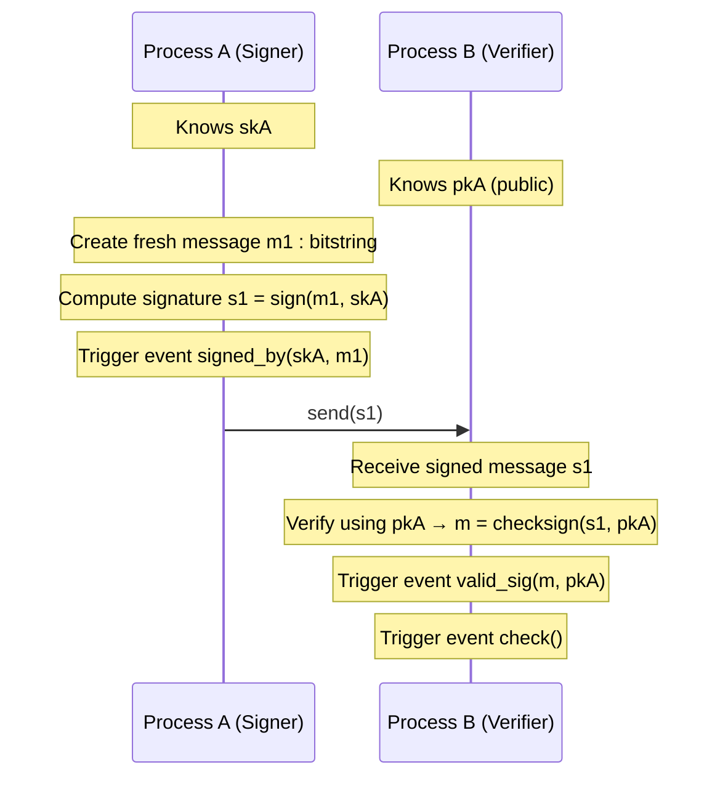

```mermaid
sequenceDiagram
    participant A as Process A (Signer)
    participant B as Process B (Verifier)

    Note over A: Knows skA
    Note over B: Knows pkA (public)

    Note over A: Create fresh message m1 : bitstring
    Note over A: Compute signature s1 = sign(m1, skA)
    Note over A: Trigger event signed_by(skA, m1)
    A->>B: send(s1)

    Note over B: Receive signed message s1
    Note over B: Verify using pkA → m = checksign(s1, pkA)
    Note over B: Trigger event valid_sig(m, pkA)
    Note over B: Trigger event check()
```
