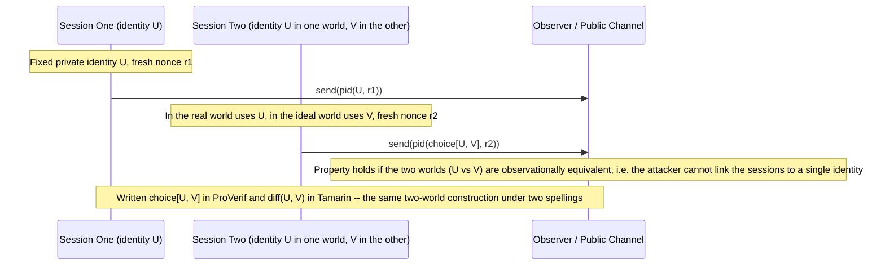

```mermaid
sequenceDiagram
    participant S1 as Session One (identity U)
    participant S2 as Session Two (identity U in one world, V in the other)
    participant O as Observer / Public Channel

    Note over S1: Fixed private identity U, fresh nonce r1
    S1->>O: send(pid(U, r1))

    Note over S2: In the real world uses U, in the ideal world uses V, fresh nonce r2
    S2->>O: send(pid(choice[U, V], r2))

    Note over O: Property holds if the two worlds (U vs V) are observationally equivalent, i.e. the attacker cannot link the sessions to a single identity
    Note over S1, O: Written choice[U, V] in ProVerif and diff(U, V) in Tamarin -- the same two-world construction under two spellings
```
