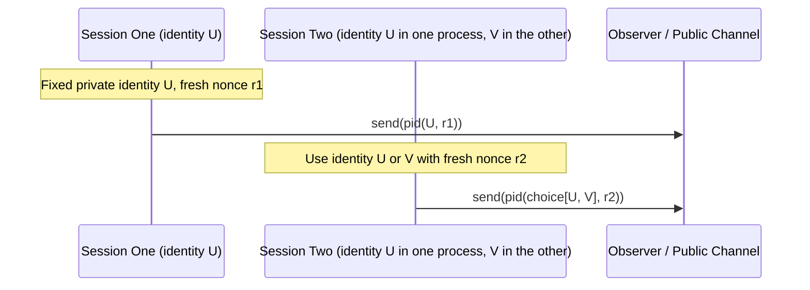

```mermaid
sequenceDiagram
    participant S1 as Session One (identity U)
    participant S2 as Session Two (identity U in one process, V in the other)
    participant O as Observer / Public Channel

    Note over S1: Fixed private identity U, fresh nonce r1
    S1->>O: send(pid(U, r1))

    Note over S2: Use identity U or V with fresh nonce r2
    S2->>O: send(pid(choice[U, V], r2))
```
